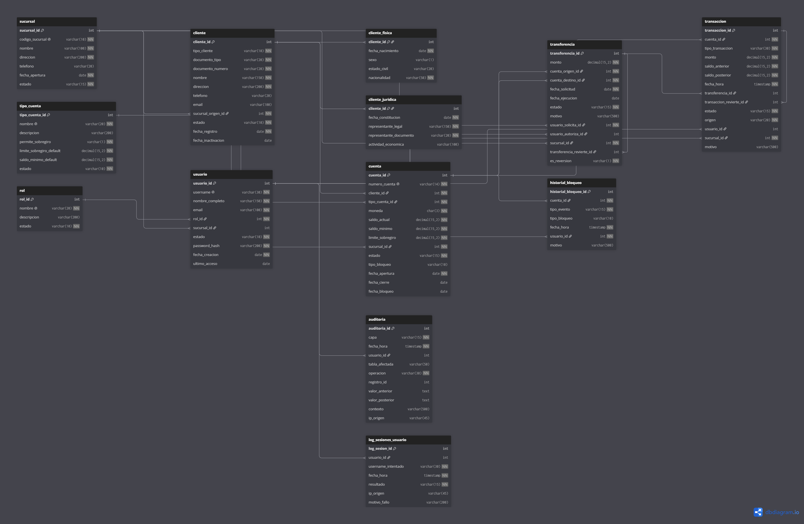

# Modelo Entidad-Relacion de CoreBank

> El archivo fuente editable del diagrama esta en `docs/diagramas/modelo-er.dbml`.
> Puedes visualizarlo en https://dbdiagram.io/d/6a847408fd15a881e5ab40da

## 1. Introduccion

Este documento describe el modelo entidad-relacion conceptual de CoreBank,
un sistema bancario simulado construido como proyecto de portafolio de
seis semanas. El objetivo es representar el dominio bancario de forma
suficiente para soportar:

- Registro de clientes y cuentas.
- Operaciones financieras basicas (depositar, retirar, transferir).
- Auditoria de cambios a nivel de aplicacion y base de datos.
- Administracion de usuarios y separacion de responsabilidades.

El modelo es **conceptual**. Las decisiones de tipos de datos especificos,
constraints, indices y triggers se documentan en los ADRs y se implementan
en los scripts DDL. Este documento no incluye CREATE TABLE.

## 2. Inventario de entidades

CoreBank esta compuesto por las siguientes entidades, agrupadas por
responsabilidad:

### Identidad y organizacion
- sucursal
- cliente
- cliente_fisica
- cliente_juridica
- usuario
- rol

### Productos y cuentas
- tipo_cuenta
- cuenta

### Operaciones financieras
- transaccion
- transferencia

### Auditoria y seguridad
- auditoria
- log_sesiones_usuario
- historial_bloqueo

Total: 13 entidades.

## 3. Entidades de identidad y organizacion

### 3.1 sucursal

**Proposito:** una ubicacion fisica u operativa del banco donde se
registran clientes y se aperturan cuentas. Es la unidad de agrupacion
para reportes operativos y para limitar el alcance de usuarios.

**Atributos:**

| Atributo | Descripcion |
|----------|-------------|
| `sucursal_id` | Identificador tecnico interno. PK. |
| `codigo_sucursal` | Codigo de negocio. Visible al usuario. UNIQUE. |
| `nombre` | Nombre descriptivo de la sucursal. |
| `direccion` | Direccion fisica. |
| `telefono` | Telefono de contacto. |
| `fecha_apertura` | Cuando se creo la sucursal en el sistema. |
| `estado` | `ACTIVA` o `INACTIVA`. |

**Relaciones:**

- Una sucursal **es origen de** muchos clientes (relacion 1:N con `cliente` mediante `cliente.sucursal_origen_id`).
- Una sucursal **apertura** muchas cuentas (relacion 1:N con `cuenta`).
- Una sucursal **tiene** muchos usuarios (relacion 1:N con `usuario`).

**Reglas que enforcea:**

- Una sucursal inactiva no deberia recibir nuevos clientes ni cuentas, pero su historial se preserva.

### 3.2 cliente

**Proposito:** persona fisica o juridica que puede ser titular de
cuentas en CoreBank. Es la entidad central del modelo.

**Atributos:**

| Atributo | Descripcion |
|----------|-------------|
| `cliente_id` | Identificador tecnico interno. PK. No reutilizable. |
| `tipo_cliente` | `FISICA` o `JURIDICA`. |
| `documento_tipo` | `CEDULA`, `RNC`, `PASAPORTE`. |
| `documento_numero` | Numero del documento. |
| `nombre` | Nombre completo o razon social. |
| `direccion` | Direccion de contacto. |
| `telefono` | Telefono de contacto. |
| `email` | Correo electronico. |
| `sucursal_origen_id` | FK a `sucursal`. |
| `estado` | `ACTIVO` o `INACTIVO`. |
| `fecha_registro` | Cuando se creo el cliente en el sistema. |
| `fecha_inactivacion` | Cuando paso a `INACTIVO`. NULL si esta activo. |

**Relaciones:**

- Un cliente pertenece a una sucursal de origen (N:1 con `sucursal`).
- Un cliente puede tener cero o una fila en `cliente_fisica`.
- Un cliente puede tener cero o una fila en `cliente_juridica`.
- Un cliente puede tener cero o muchas cuentas (1:0..N con `cuenta`).

**Especializacion: TOTAL y DISJUNTA**

`CLIENTE` se especializa de forma **total y disjunta** en
`CLIENTE_FISICA` y `CLIENTE_JURIDICA`.

- Si `cliente.tipo_cliente = 'FISICA'`, debe existir exactamente una fila
  correspondiente en `cliente_fisica` y no debe existir una fila en
  `cliente_juridica` para el mismo `cliente_id`.
- Si `cliente.tipo_cliente = 'JURIDICA'`, debe existir exactamente una fila
  correspondiente en `cliente_juridica` y no debe existir una fila en
  `cliente_fisica` para el mismo `cliente_id`.

Por tanto, todo `CLIENTE` debe pertenecer exactamente a una de las dos
especializaciones.

**Reglas que enforcea:**

- `cliente_id` nunca se reutiliza.
- `(documento_tipo, documento_numero)` es unico en el sistema.
- Un cliente inactivo no puede abrir cuentas nuevas ni realizar operaciones.
- La especializacion de `CLIENTE` es TOTAL y DISJUNTA.
- La correspondencia entre `tipo_cliente` y su tabla de especializacion debe
  mantenerse consistente.

**Nota relacional:**

La especializacion TOTAL y DISJUNTA no puede garantizarse mediante una FK
simple. El mecanismo de enforcement fisico se definira posteriormente en un
ADR, evaluando trigger frente a logica de aplicacion.

### 3.3 cliente_fisica

**Proposito:** especializacion de cliente con datos propios de personas
fisicas.

**Atributos:**

| Atributo | Descripcion |
|----------|-------------|
| `cliente_id` | PK. FK a `cliente`. |
| `fecha_nacimiento` | Requerida para validar mayoria de edad. |
| `sexo` | `M`, `F`. Opcional. |
| `estado_civil` | `SOLTERO`, `CASADO`, etc. Opcional. |
| `nacionalidad` | Pais de origen. |

**Relaciones:**

- Una fila de `cliente_fisica` pertenece a exactamente un cliente (1:1 con `cliente`).

### 3.4 cliente_juridica

**Proposito:** especializacion de cliente con datos propios de personas
juridicas.

**Atributos:**

| Atributo | Descripcion |
|----------|-------------|
| `cliente_id` | PK. FK a `cliente`. |
| `fecha_constitucion` | Cuando se constituyo la empresa. |
| `representante_legal` | Nombre del representante. |
| `representante_documento` | Cedula del representante. |
| `actividad_economica` | Descripcion de la actividad principal. |

**Relaciones:**

- Una fila de `cliente_juridica` pertenece a exactamente un cliente (1:1 con `cliente`).

**Nota relacional sobre la especializacion de cliente:**

La relacion 1:1 entre `cliente` y sus tablas satelite requiere una
invariante que no puede ser enforceda por una FK simple: si
`cliente.tipo_cliente = 'FISICA'`, debe existir una fila en
`cliente_fisica` y no debe existir fila en `cliente_juridica` con el
mismo `cliente_id`. Esta invariante se resolvera en la implementacion
Oracle mediante triggers o logica de aplicacion, decision que se
documentara en el ADR correspondiente.

### 3.5 usuario

**Proposito:** personal de CoreBank que opera el sistema.

**Atributos:**

| Atributo | Descripcion |
|----------|-------------|
| `usuario_id` | Identificador tecnico. PK. |
| `username` | Login. UNIQUE. |
| `nombre_completo` | Nombre real. |
| `email` | Correo corporativo. |
| `rol_id` | FK a `rol`. |
| `sucursal_id` | FK a `sucursal`. NULL solo para `ADMIN`. |
| `estado` | `ACTIVO` o `INACTIVO`. |
| `password_hash` | Hash de la contrasena. |
| `fecha_creacion` | Cuando se creo el usuario. |
| `ultimo_acceso` | Ultima vez que hizo login. |

**Relaciones:**

- Un usuario pertenece a un rol (N:1 con `rol`).
- Un usuario puede pertenecer a una sucursal (N:0..1 con `sucursal`).
- Un usuario realiza muchas acciones registradas en `auditoria` (1:N).
- Un usuario realiza muchos intentos de acceso en `log_sesiones_usuario` (1:N).
- Un usuario puede autorizar muchas transferencias (1:N con `transferencia`).

**Reglas que enforcea:**

- `rol = 'ADMIN'` implica `sucursal_id IS NULL`.
- `rol <> 'ADMIN'` implica `sucursal_id IS NOT NULL`.
- Un usuario solo puede operar cuentas de su sucursal, excepto `ADMIN` y `AUDITOR`.

### 3.6 rol

**Proposito:** catalogo de roles del sistema.

**Atributos:**

| Atributo | Descripcion |
|----------|-------------|
| `rol_id` | PK. |
| `nombre` | `CAJERO`, `SUPERVISOR`, `AUDITOR`, `ADMIN`. UNIQUE. |
| `descripcion` | Texto explicativo. |
| `estado` | `ACTIVO` o `INACTIVO`. |

**Relaciones:**

- Un rol puede ser asignado a muchos usuarios (1:N con `usuario`).

## 4. Entidades de productos y cuentas

### 4.1 tipo_cuenta

**Proposito:** catalogo de productos bancarios que CoreBank ofrece.

**Atributos:**

| Atributo | Descripcion |
|----------|-------------|
| `tipo_cuenta_id` | Identificador tecnico. PK. |
| `nombre` | `AHORRO`, `CORRIENTE`. UNIQUE. |
| `descripcion` | Texto explicativo. |
| `permite_sobregiro` | `S` o `N`. |
| `limite_sobregiro_default` | Limite por defecto. |
| `saldo_minimo_default` | Saldo minimo por defecto. |
| `estado` | `ACTIVO` o `INACTIVO`. |

**Relaciones:**

- Un tipo de cuenta puede ser usado para aperturar muchas cuentas (1:N con `cuenta`).

**Reglas que enforcea:**

- `limite_sobregiro_default >= 0`.
- `saldo_minimo_default >= 0`.
- Si `permite_sobregiro = 'N'`, entonces `limite_sobregiro_default = 0`.
- Las reglas concretas de cada cuenta se copian en `cuenta` al aperturar.

### 4.2 cuenta

**Proposito:** la entidad central del producto bancario.

**Atributos:**

| Atributo | Descripcion |
|----------|-------------|
| `cuenta_id` | Identificador tecnico. PK. No reutilizable. |
| `numero_cuenta` | Identificador de negocio. UNIQUE. Formato `SSS-NNNNNNNNNN`. |
| `cliente_id` | FK a `cliente`. |
| `tipo_cuenta_id` | FK a `tipo_cuenta`. |
| `moneda` | ISO 4217. Solo `DOP` en el MVP. |
| `saldo_actual` | Saldo materializado. |
| `saldo_minimo` | Snapshot del producto. |
| `limite_sobregiro` | Snapshot del producto. |
| `sucursal_id` | FK a `sucursal`. Sucursal de apertura. |
| `estado` | `ACTIVA`, `BLOQUEADA`, `CERRADA`. |
| `tipo_bloqueo` | `DEBITO`, `CREDITO`, `TOTAL`. |
| `fecha_apertura` | Inmutable. |
| `fecha_cierre` | NULL si no esta cerrada. |
| `fecha_bloqueo` | Fecha del ultimo bloqueo. |

**Relaciones:**

- Una cuenta pertenece a un cliente (N:1 con `cliente`).
- Un cliente puede tener cero o muchas cuentas (1:0..N).
- Una cuenta tiene un tipo de producto (N:1 con `tipo_cuenta`).
- Una cuenta fue aperturada en una sucursal (N:1 con `sucursal`).
- Una cuenta puede tener cero o muchas transacciones (1:0..N con transaccion).
- Una cuenta puede tener muchos eventos de bloqueo (1:N con `historial_bloqueo`).

**Reglas que enforcea:**

- `saldo_actual >= -limite_sobregiro`.
- `numero_cuenta` unico.
- `saldo_minimo >= 0` y `limite_sobregiro >= 0`.
- Si la cuenta no permite sobregiro, `limite_sobregiro = 0`.
- Combinacion valida de `estado`, `tipo_bloqueo`, `fecha_bloqueo`, `fecha_cierre`.
- `fecha_cierre >= fecha_apertura`.
- `moneda = 'DOP'`.

**Notas relacionales:**

1. **Snapshot de condiciones contractuales.** Los valores de `saldo_minimo` y `limite_sobregiro` se copian desde `tipo_cuenta` al aperturar.
2. **`fecha_bloqueo` como dato historico.** Representa el ultimo bloqueo. Historial completo en `historial_bloqueo`.
3. **Sucursal de apertura inmutable.** No cambia una vez aperturada.
4. **`numero_cuenta` y `sucursal_id` no son lo mismo.** El numero se forma con `codigo_sucursal`.
5. **El CHECK de saldo no garantiza legitimidad de operaciones.** Protege invariante estructural.
6. **Inmutabilidad del saldo.** `saldo_actual` es mutable pero gobernado por logica transaccional.

## 5. Entidades de operaciones financieras

### 5.1 transaccion

**Proposito:** movimiento financiero individual sobre una cuenta.

**Atributos:**

| Atributo | Descripcion |
|----------|-------------|
| `transaccion_id` | Identificador tecnico. PK. |
| `cuenta_id` | FK a `cuenta`. |
| `tipo_transaccion` | `DEPOSITO`, `RETIRO`, `TRANSFERENCIA_DEBITO`, `TRANSFERENCIA_CREDITO`, `COMISION`, `REVERSION`. |
| `monto` | Siempre positivo. |
| `saldo_anterior` | Inmutable. |
| `saldo_posterior` | Inmutable. |
| `fecha_hora` | Asignada por el sistema. |
| `transferencia_id` | FK opcional a `transferencia`. |
| `transaccion_revierte_id` | FK opcional a `transaccion`. |
| `estado` | `APLICADA`, `REVERTIDA`, `FALLIDA`. |
| `origen` | `VENTANILLA`, `CAJERO`, `SISTEMA`, `TRANSFERENCIA`. |
| `usuario_id` | FK a `usuario`. NULL si `origen = 'SISTEMA'`. |
| `sucursal_id` | FK a `sucursal`. |
| `motivo` | Razon del movimiento. |

**Relaciones:**

- Una transaccion afecta una cuenta (N:1 con `cuenta`).
- Una transaccion puede pertenecer a una transferencia (N:0..1 con `transferencia`).
- Una transaccion puede revertir a otra (N:0..1 reflexiva).
- Una transaccion fue ejecutada por un usuario (N:0..1 con `usuario`).
- Una transaccion fue ejecutada en una sucursal (N:1 con `sucursal`).

**Reglas que enforcea:**

- `monto > 0`.
- `saldo_posterior = saldo_anterior +/- monto`.
- `estado` transiciona de `APLICADA` a `REVERTIDA` solo por reversion valida.
- `transaccion_revierte_id` NOT NULL solo si `tipo_transaccion = 'REVERSION'`.
- `tipo_transaccion` de transferencia implica `transferencia_id IS NOT NULL`.
- `saldo_anterior` y `saldo_posterior` son inmutables.
- Si `origen = 'SISTEMA'`, `usuario_id` puede ser NULL.
- Una transaccion `APLICADA` solo puede ser revertida una vez.

### 5.2 transferencia

**Proposito:** operacion de negocio que mueve saldo entre dos cuentas.

**Atributos:**

| Atributo | Descripcion |
|----------|-------------|
| `transferencia_id` | Identificador tecnico. PK. |
| `monto` | Siempre positivo. |
| `cuenta_origen_id` | FK a `cuenta`. |
| `cuenta_destino_id` | FK a `cuenta`. |
| `fecha_solicitud` | Cuando se solicito. |
| `fecha_ejecucion` | Cuando se ejecuto. NULL si no se ejecuto. |
| `estado` | `COMPLETADA`, `FALLIDA`, `REVERTIDA`. |
| `motivo` | Razon de la operacion. |
| `usuario_solicita_id` | FK a `usuario`. |
| `usuario_autoriza_id` | FK opcional a `usuario`. |
| `sucursal_id` | FK a `sucursal`. |
| `transferencia_revierte_id` | FK opcional a `transferencia`. |
| `es_reversion` | `S` o `N`. |

**Relaciones:**

- Una transferencia tiene cuenta origen (N:1 con `cuenta`).
- Una transferencia tiene cuenta destino (N:1 con `cuenta`).
- Una transferencia puede revertir a otra (N:0..1 reflexiva).
- Una transferencia fue solicitada por un usuario (N:1 con `usuario`).
- Una transferencia puede haber sido autorizada por un usuario (N:0..1 con `usuario`).
- Una transferencia fue solicitada en una sucursal (N:1 con `sucursal`).
- Una transferencia puede tener cero o dos transacciones (1:0..2 con `transaccion`).

**Reglas que enforcea:**

- `monto > 0`.
- `cuenta_origen_id <> cuenta_destino_id`.
- Una transferencia `COMPLETADA` debe tener exactamente dos transacciones aplicadas:
  una `TRANSFERENCIA_DEBITO` y una `TRANSFERENCIA_CREDITO`.
- Las dos transacciones de una transferencia `COMPLETADA` deben compartir el mismo
  `transferencia_id`.
- Una transferencia `FALLIDA` no debe dejar transacciones aplicadas asociadas.
- Una transferencia `REVERTIDA` debe estar asociada a una operación de reversión
  que compense los movimientos de la transferencia original.
- `es_reversion = 'S'` implica `transferencia_revierte_id IS NOT NULL`.
- Una transferencia `COMPLETADA` solo puede ser revertida una vez.

**Regla de atomicidad conceptual:**

Una transferencia interna debe ejecutarse de forma atomica: el debito de la
cuenta origen y el credito de la cuenta destino constituyen una unica operacion
de negocio y deben confirmarse conjuntamente. Si alguna parte falla, ninguna
de las dos transacciones debe quedar aplicada.

**Interpretacion de la cardinalidad TRANSFERENCIA → TRANSACCION:**

La relacion `1:0..2` significa:

- `0` transacciones: la transferencia aun no ha producido movimientos contables,
  por ejemplo, cuando queda `FALLIDA` antes de aplicar movimientos.
- `2` transacciones: la transferencia fue ejecutada correctamente y contiene
  exactamente un debito y un credito.
- No debe existir una transferencia con una sola transaccion aplicada.

**Ciclo de vida de una transferencia:**

1. **Registro de la solicitud:** se registra la transferencia y se realizan las
   validaciones iniciales.
2. **Ejecucion economica:** si las validaciones son satisfactorias, se aplican
   de forma atomica el debito y el credito. Si ambos movimientos tienen exito,
   la transferencia pasa a `COMPLETADA`.
3. **Fallo:** si alguna parte de la ejecucion falla, la operacion completa debe
   revertirse y la transferencia pasa a `FALLIDA` sin movimientos contables
   aplicados.
4. **Reversion:** una transferencia `COMPLETADA` puede ser revertida mediante
   una nueva operacion de reversion que compense sus movimientos originales.
   La transferencia original pasa a `REVERTIDA`.

## 6. Entidades de auditoria y seguridad

### 6.1 auditoria

**Proposito:** registro append-only de operaciones en CoreBank. Cubre
la auditoria de aplicacion y la de base de datos, distinguidas por el
campo `capa`.

**Atributos:**

| Atributo | Descripcion |
|----------|-------------|
| `auditoria_id` | Identificador tecnico. PK. |
| `capa` | `APLICACION` o `BASE_DATOS`. |
| `fecha_hora` | Asignada por el sistema. |
| `usuario_id` | FK opcional a `usuario`. |
| `tabla_afectada` | Nombre de la tabla afectada. |
| `operacion` | `INSERT`, `UPDATE`, `DELETE`, `LOGIN`, etc. |
| `registro_id` | PK de la fila afectada. |
| `valor_anterior` | Estado antes del cambio. |
| `valor_posterior` | Estado despues del cambio. |
| `contexto` | Informacion adicional del contexto. |
| `ip_origen` | Desde donde se ejecuto. |

**Reglas que enforcea:**

- Tabla append-only. No se permiten `UPDATE` ni `DELETE`.
- Solo el rol `AUDITOR` puede consultar la tabla.
- `capa = 'BASE_DATOS'` se registra mediante triggers.
- `capa = 'APLICACION'` se registra mediante logica de aplicacion.

### 6.2 log_sesiones_usuario

**Proposito:** registro de intentos de acceso al sistema.

**Atributos:**

| Atributo | Descripcion |
|----------|-------------|
| `log_sesion_id` | Identificador tecnico. PK. |
| `usuario_id` | FK opcional a `usuario`. |
| `username_intentado` | Nombre intentado. |
| `fecha_hora` | Cuando ocurrio. |
| `resultado` | `EXITOSO`, `FALLIDO`, `BLOQUEADO`. |
| `ip_origen` | Desde donde se intento. |
| `motivo_fallo` | Razon del fallo. |

**Reglas que enforcea:**

- Tabla append-only.
- `resultado = 'BLOQUEADO'` ocurre por acumular intentos fallidos.
- `usuario_id` puede ser NULL si el username no existe.

### 6.3 historial_bloqueo

**Proposito:** registro cronologico de eventos de bloqueo y desbloqueo.

**Atributos:**

| Atributo | Descripcion |
|----------|-------------|
| `historial_bloqueo_id` | Identificador tecnico. PK. |
| `cuenta_id` | FK a `cuenta`. |
| `tipo_evento` | `BLOQUEO`, `DESBLOQUEO`. |
| `tipo_bloqueo` | `DEBITO`, `CREDITO`, `TOTAL`. Solo para `BLOQUEO`. |
| `fecha_hora` | Cuando ocurrio. |
| `usuario_id` | FK a `usuario`. |
| `motivo` | Razon del evento. |

**Reglas que enforcea:**

- `tipo_evento = 'BLOQUEO'` implica `tipo_bloqueo IS NOT NULL`.
- `tipo_evento = 'DESBLOQUEO'` implica `tipo_bloqueo IS NULL`.

**Relacion con `cuenta.fecha_bloqueo`:**

La columna `cuenta.fecha_bloqueo` es una denormalizacion controlada de la informacion mas reciente de `historial_bloqueo`. La coherencia se mantiene mediante trigger o logica de aplicacion.

## 7. Diagrama general de relaciones

sucursal ├──< cliente │ ├──< cliente_fisica │ ├──< cliente_juridica │ └──< cuenta │ ├──< transaccion │ │ ├──> transferencia (opcional) │ │ └──> transaccion (reflexiva) │ └──< historial_bloqueo ├──< cuenta └──< usuario ├──> rol ├──< auditoria ├──< log_sesiones_usuario └──< transferencia (solicita/autoriza)

transferencia ├──> cuenta (origen) ├──> cuenta (destino) └──< transaccion (0..2)

## 8. Cardinalidades consolidadas

| Origen | Destino | Cardinalidad |
|--------|---------|--------------|
| SUCURSAL | CLIENTE | 1:N |
| SUCURSAL | CUENTA | 1:N |
| SUCURSAL | USUARIO | 0:N |
| CLIENTE | CLIENTE_FISICA | 1:0..1* |
| CLIENTE | CLIENTE_JURIDICA | 1:0..1* |
| CLIENTE | CUENTA | 1:0..N |
| ROL | USUARIO | 1:N |
| USUARIO | SUCURSAL | 0..1 |
| TIPO_CUENTA | CUENTA | 1:N |
| CUENTA | TRANSACCION | **1:0..N** |
| TRANSFERENCIA | TRANSACCION | **1:0..2** |
| USUARIO | AUDITORIA | 1:N |
| USUARIO | LOG_SESIONES_USUARIO | 1:0..N |
| CUENTA | HISTORIAL_BLOQUEO | 1:0..N |

\* `CLIENTE_FISICA` y `CLIENTE_JURIDICA` forman una especializacion
**TOTAL y DISJUNTA** de `CLIENTE`. Por tanto, cada cliente debe pertenecer
exactamente a una de las dos especializaciones.

## 9. Resumen final

**Entidades:** 13 totales.

**Fases siguientes:**
1. Modelo relacional.
2. ADR-002 a ADR-005.
3. DDL completo.
4. Pruebas.
